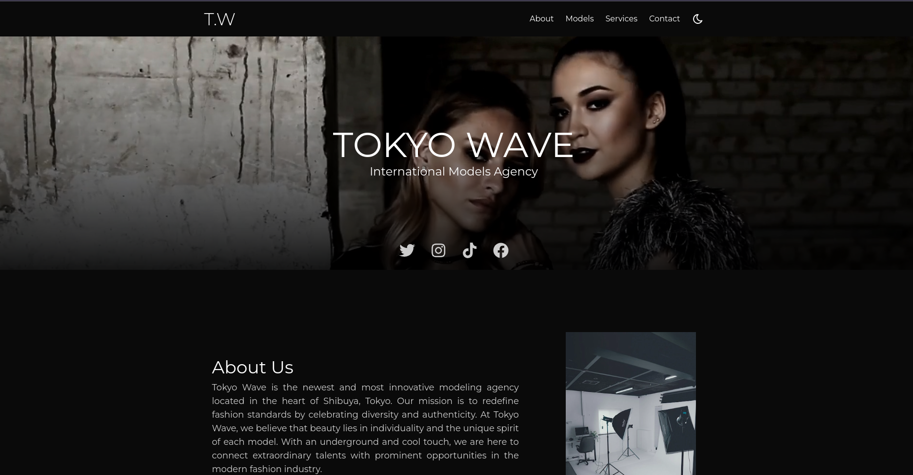
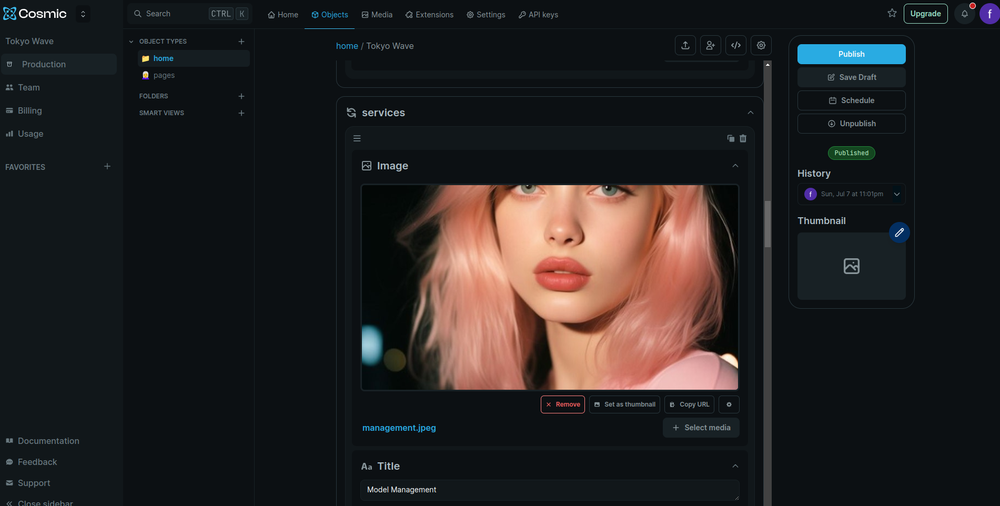

# Tokyo Wave

## Description

Tokyo Wave is a fictitious modeling agency site for Tokyo Shibuya. It was developed with 
Next.js 14, TypeScript, Tailwind, and integrated with the Cosmic API. The project is fully responsive.

## Installation

1. Clone the repository: `git clone https://github.com/yourusername/tokyo-wave.git`
2. Navigate to the project directory: `cd tokyo-wave`

### Yarn

3. Install dependencies: `yarn install`
4. Start the application: `yarn dev`

### NPM

3. Install dependencies: `npm install`
4. Start the application: `npm run dev`

### PNPM

3. Install dependencies: `pnpm install`
4. Start the application: `pnpm dev`

## Cosmic JS CMS

The Cosmic JS CMS allows you to change the title, banner, and introduce models. It provides an 
easy-to-use interface for managing the site's content.

## Development Setup

The project features a configuration of Prettier and Tailwind Sorter integrated with ESLint. 
You can see this configuration in action in this [GUI](https://nept-guide.vercel.app/).

## Deployment

The project is deployed at [tokyo-wave.vercel.app](https://tokyo-wave.vercel.app).

## Key Technologies

- Next.js 14
- TypeScript
- Tailwind CSS
- Cosmic JS

